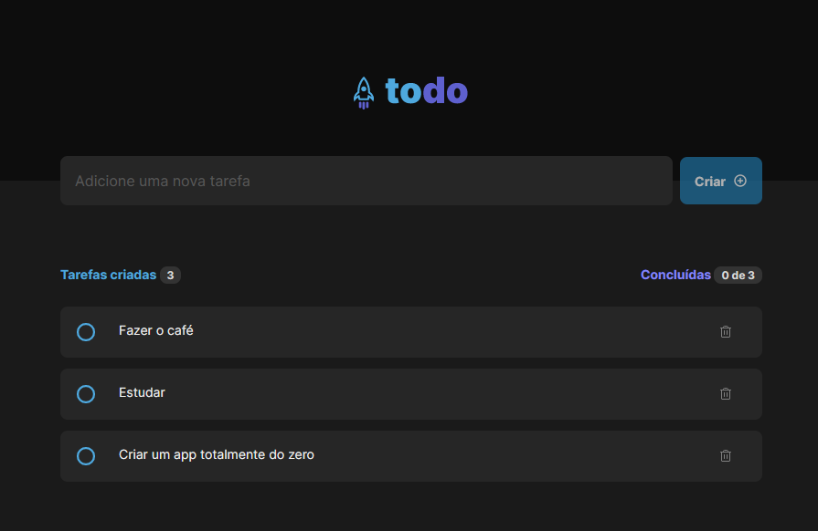

# Desafio To Do Ignite

<h1 align="center">
   
</h1>

### Sobre o projeto

O Projeto tem como objetivo desafiar o aluno a contruir um aplicação em ReactJS, com intuito de treinar os conhecimento mais importantes do ReactJS. Nesse projeto foi aplicado os conceitos de Estado, Imutabilidade, Keys, Propriedades e Componentes.

---

### Tecnologias
<p>


</p>

### Iniciando o projeto

```bash
# Clonar aplicação

$ git clone https://github.com/Jhonatan-Holanda/challengeToDoList

# Acessar a aplicação
$ cd challengeToDoList

# Execute npm i para instalar as dependências
$ npm i

# Inicie a aplicação
$ npm dev

```
